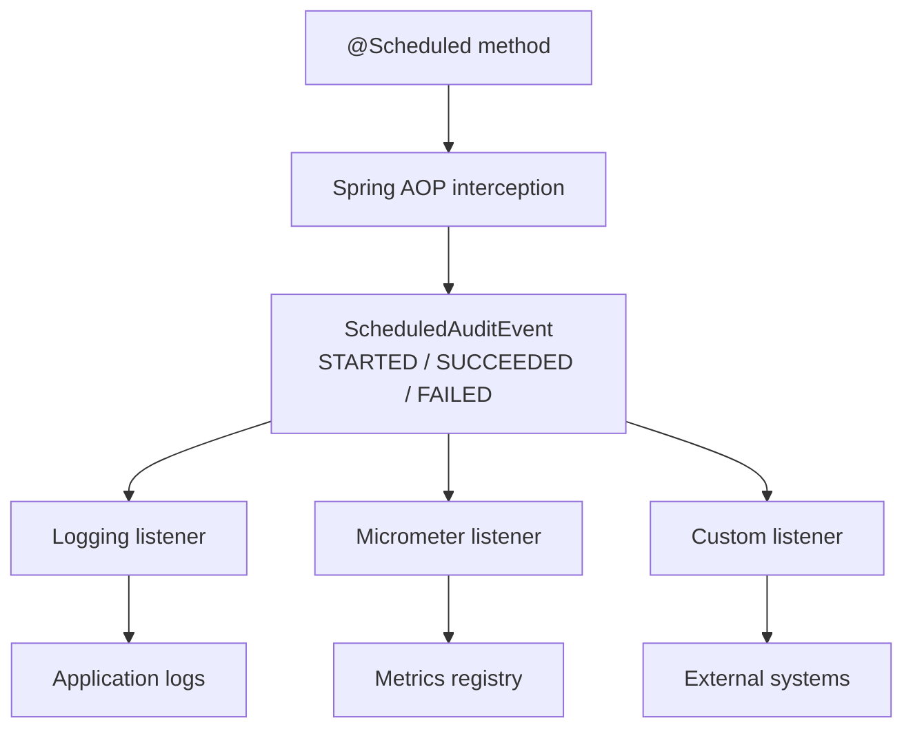

# Scheduled Audit AutoConfigure

[](https://central.sonatype.com/artifact/io.github.mavencrafted/scheduled-audit-autoconfigure/overview)
[](https://javadoc.io/doc/io.github.mavencrafted/scheduled-audit-autoconfigure)
[](https://github.com/MavenCrafted/scheduled-audit-autoconfigure/actions/workflows/ci.yml)
[](https://github.com/MavenCrafted/scheduled-audit-autoconfigure/actions/workflows/codeql.yml)

Automatic audit events for Spring `@Scheduled` jobs.

This library instruments scheduled task execution and publishes structured audit events for:

- Job started
- Job completed successfully
- Job failed

It allows applications to:

- Track scheduled job execution
- Send audit events to external systems
- Collect metrics through Micrometer
- Build operational dashboards and alerts
- Standardize scheduled-job observability across services

## Requirements

- Java 17+
- Spring Boot 3+
- Spring Scheduling enabled, for example with `@EnableScheduling`
- Spring AOP, usually through `spring-boot-starter-aop`

## Compatibility

| Library version | Spring Boot version | Java version | Status |
| --- | --- | --- | --- |
| `2.3.1` | `3.x` | `17+` (tested on `17`, `21`, and `25`) | Supported and tested |
| `2.3.1` | `2.x` | Not applicable | Unsupported |
| `2.3.1` | `4.x` | Not tested | Not officially supported |

Library version `1.x` is no longer supported.

## Installation

Maven:

```xml
<dependency>
    <groupId>io.github.mavencrafted</groupId>
    <artifactId>scheduled-audit-autoconfigure</artifactId>
    <version>2.3.1</version>
</dependency>

<dependency>
    <groupId>org.springframework.boot</groupId>
    <artifactId>spring-boot-starter-aop</artifactId>
</dependency>
```

Gradle:

```groovy
implementation "io.github.mavencrafted:scheduled-audit-autoconfigure:2.3.1"
implementation "org.springframework.boot:spring-boot-starter-aop"
```

## Quick Start

```java
import io.github.mavencrafted.scheduling.audit.ScheduledAudit;
import org.springframework.scheduling.annotation.Scheduled;
import org.springframework.stereotype.Component;

@Component
public class CleanupJob {

    @Scheduled(cron = "0 0 * * * *")
    @ScheduledAudit(
            schedulerId = "cleanup-job",
            tags = {"maintenance", "cleanup"}
    )
    public void execute() {
        // business logic
    }
}
```

No additional library configuration is required. The auto-configuration is enabled by default when the library and Spring AOP are present.

By default, the library audits all Spring `@Scheduled` methods. To emit audit events only for methods that explicitly declare `@ScheduledAudit`, use:

```yaml
scheduled-audit:
  scope: annotated
```

## Example Application

A runnable Spring Boot example is available in [`examples/scheduled-audit-demo`](examples/scheduled-audit-demo). It demonstrates a successful scheduled job and an intentionally failing scheduled job so both `SUCCEEDED` and `FAILED` audit events are visible.

From the repository root:

```sh
./mvnw install
cd examples/scheduled-audit-demo
../../mvnw spring-boot:run
```

## Core Concept: schedulerId

Every job annotated with `@ScheduledAudit` must define a unique `schedulerId`.

```java
@ScheduledAudit(schedulerId = "daily-report")
```

The `schedulerId` is the stable business identifier for a scheduled task. It is used for:

- Audit events
- Metrics
- Alerting
- Dashboards
- Correlation across deployments

Rules:

- Required by `@ScheduledAudit`
- Must be globally unique across scheduled bean instances in the application
- Whitespace is trimmed before use
- Blank values fail application startup
- Startup fails when duplicate IDs are detected

By default, Spring `@Scheduled` methods without `@ScheduledAudit` are allowed and emit events without a
`schedulerId`. To require every scheduled method to declare a scheduler ID, use:

```yaml
scheduled-audit:
  scheduler-id-policy: required
```

Good:

```java
schedulerId = "daily-report"
schedulerId = "cleanup-job"
schedulerId = "invoice-reconciliation"
```

Bad:

```java
schedulerId = "job1"
schedulerId = "task"
schedulerId = "scheduled-task"
```

## Production Usage

For production platforms, start from this conservative baseline:

```yaml
scheduled-audit:
  scope: annotated
  scheduler-id-policy: required
  logging:
    enabled: false
  metrics:
    enabled: true
```

This mode gives you:

- Events only for jobs that explicitly declare `@ScheduledAudit`
- Startup failure when a Spring `@Scheduled` method lacks `@ScheduledAudit(schedulerId = "...")`
- Startup validation that scheduler IDs are non-blank and unique
- No default audit logs; events should be handled by an explicit `ScheduledAuditListener`
- Terminal execution metrics when a `MeterRegistry` is available

Use a custom `ScheduledAuditListener` to forward events to an approved audit, monitoring, or messaging system. This library does not provide durable audit storage or compliance controls, and failed-job messages may contain sensitive data.

Release artifacts include source and Javadoc jars. Releases also generate CycloneDX SBOM files and GitHub artifact provenance attestations for published JAR and SBOM artifacts.

## How It Works



## Audit Event Lifecycle

A single execution produces:

```text
STARTED
  |
  v
SUCCEEDED
```

or:

```text
STARTED
  |
  v
FAILED
```

The same `executionId` is shared by the `STARTED` event and its terminal `SUCCEEDED` or `FAILED` event.

## Listening To Events

Implement `ScheduledAuditListener` to publish, persist, or forward audit events.

```java
import io.github.mavencrafted.scheduling.audit.ScheduledAuditEvent;
import io.github.mavencrafted.scheduling.audit.ScheduledAuditListener;
import org.springframework.stereotype.Component;

@Component
public class AuditPublisher implements ScheduledAuditListener {

    @Override
    public void onEvent(ScheduledAuditEvent event) {
        // publish to Kafka
        // store in a database
        // forward to SIEM
    }
}
```

Runtime exceptions from listeners are logged and isolated. Listener failures do not interrupt scheduled-job execution, and remaining listeners still receive the event.

## Event Structure

`ScheduledAuditEvent` contains:

- `executionId`
- `scheduledMethod`
- `schedulerId`
- `status`
- `startedAt`
- `finishedAt`
- `duration`
- `tags`
- `failure`

Statuses:

- `STARTED`
- `SUCCEEDED`
- `FAILED`

Example event payload when serialized by an application:

```json
{
  "executionId": "8f8df9b2-c84c-4a54-a6a4-7cd0f9c0f6ee",
  "scheduledMethod": "com.example.CleanupJob.execute",
  "schedulerId": "cleanup-job",
  "status": "SUCCEEDED",
  "startedAt": "2026-05-06T19:22:00.012974Z",
  "finishedAt": "2026-05-06T19:22:02.326974Z",
  "duration": "PT2.314S",
  "tags": ["maintenance", "cleanup"]
}
```

## Metrics

When Micrometer is present and metrics are enabled, execution metrics are published automatically for terminal events that have a `schedulerId`.

```yaml
scheduled-audit:
  metrics:
    enabled: true
```

Metric names:

- `mavencrafted.scheduled.audit.executions`
- `mavencrafted.scheduled.audit.duration`

Dimensions:

- `scheduler.id`
- `status`

Status values:

- `SUCCEEDED`
- `FAILED`

Applications using Spring Boot Actuator typically already provide a Micrometer `MeterRegistry`. Metrics can then be exported through the usual Micrometer integrations, such as Prometheus, Datadog, New Relic, Grafana Cloud, or OpenTelemetry.

## Logging

The default logging listener is enabled by default. It writes `STARTED` and `SUCCEEDED` events at `DEBUG` level and `FAILED` events at `ERROR` level.

```yaml
logging:
  level:
    io.github.mavencrafted: DEBUG
```

Example log lines:

```text
Scheduled task started [executionId=8f8df9b2-c84c-4a54-a6a4-7cd0f9c0f6ee, scheduledMethod=com.example.CleanupJob.execute, schedulerId=cleanup-job, startedAt=2026-05-06T19:22:00.012974Z]
Scheduled task succeeded [executionId=8f8df9b2-c84c-4a54-a6a4-7cd0f9c0f6ee, scheduledMethod=com.example.CleanupJob.execute, schedulerId=cleanup-job, startedAt=2026-05-06T19:22:00.012974Z, finishedAt=2026-05-06T19:22:02.326974Z, duration=PT2.314S]

Scheduled task started [executionId=3fceebec-f3f9-4acb-bcb7-dc78ac4c8b8b, scheduledMethod=com.example.CleanupJob.execute, schedulerId=cleanup-job, startedAt=2026-05-06T19:22:00.012974Z]
Scheduled task failed [executionId=3fceebec-f3f9-4acb-bcb7-dc78ac4c8b8b, scheduledMethod=com.example.CleanupJob.execute, schedulerId=cleanup-job, startedAt=2026-05-06T19:23:00.028913Z, finishedAt=2026-05-06T19:23:01.037654Z, duration=PT1.008741S, failureType=java.lang.IllegalStateException, failureMessage=Scheduled task failed]
```

Set `scheduled-audit.logging.include-stacktrace=true` to include full failure stack traces.

Use `scheduled-audit.logging.include-tags` to log only events that have at least one configured tag. Use `scheduled-audit.logging.exclude-tags` to suppress events with matching tags. Excluded tags take precedence over included tags.

## AOP Limitations

This library uses Spring AOP interception. Because of Spring proxy behavior:

- Self-invocation is not intercepted
- Final methods are not advised
- Final classes may not be proxied
- Only Spring-managed beans are supported

Example:

```java
public void methodA() {
    methodB();
}

@Scheduled(cron = "0 0 * * * *")
@ScheduledAudit(schedulerId = "daily-report")
public void methodB() {
    // scheduled work
}
```

The direct call from `methodA()` to `methodB()` bypasses Spring AOP.

## Failure Handling

When a scheduled task throws an exception:

- A `FAILED` event is emitted
- Execution duration is recorded
- The original exception is rethrown
- Spring scheduling behavior remains unchanged

The library never swallows application exceptions.

## Configuration

```yaml
scheduled-audit:
  enabled: true
  scope: all
  scheduler-id-policy: optional
  logging:
    enabled: true
    include-stacktrace: false
    include-tags: []
    exclude-tags: []
  metrics:
    enabled: false
```

| Property | Default | Description |
| --- | --- | --- |
| `scheduled-audit.enabled` | `true` | Enables scheduled audit auto-configuration. |
| `scheduled-audit.scope` | `all` | Controls which scheduled methods emit audit events. Use `all` to audit every Spring `@Scheduled` method, or `annotated` to audit only methods that also declare `@ScheduledAudit`. |
| `scheduled-audit.scheduler-id-policy` | `optional` | Controls whether plain Spring `@Scheduled` methods may omit `@ScheduledAudit`. Use `optional` to allow events without a scheduler ID, or `required` to fail startup unless every scheduled method declares `@ScheduledAudit(schedulerId = "...")`. |
| `scheduled-audit.logging.enabled` | `true` | Enables the default logging listener. |
| `scheduled-audit.logging.include-stacktrace` | `false` | Includes the thrown exception stack trace for failed scheduled executions. |
| `scheduled-audit.logging.include-tags` | empty | Logs only events with at least one matching tag when configured. |
| `scheduled-audit.logging.exclude-tags` | empty | Suppresses events with matching tags. Takes precedence over `include-tags`. |
| `scheduled-audit.metrics.enabled` | `false` | Enables the Micrometer metrics listener. Requires Micrometer on the classpath and a `MeterRegistry` bean. |

## Design Goals

- Zero business-code changes beyond declaring audit metadata
- Explicit job identity
- Low operational overhead
- Micrometer integration
- Framework-neutral event consumers
- Production-safe failure isolation

## When To Use This Library

Use it when you need:

- Operational visibility for scheduled jobs
- Audit trails
- Alerting on failures
- Metrics and dashboards
- Standardized job execution reporting

Do not use it as a job scheduler replacement.

## Migration From 1.x

Version `2.0.0` intentionally renamed task-oriented event API to scheduled-method terminology. Consumers that handled `ScheduledAuditEvent` directly should replace `getTaskName()` with `getScheduledMethod()`. Event construction helpers are internal because events are emitted by the auto-configuration; application code should consume events through `ScheduledAuditListener`.
